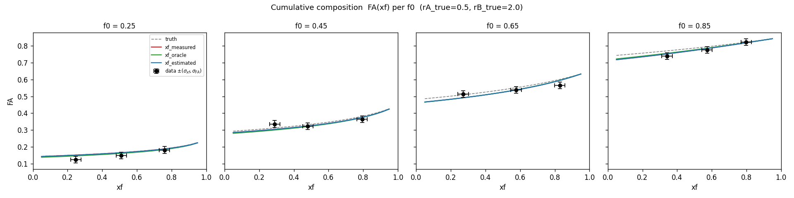
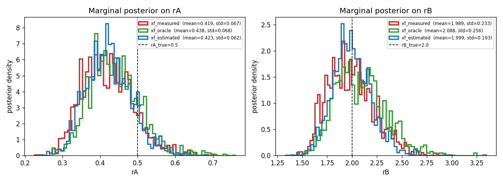
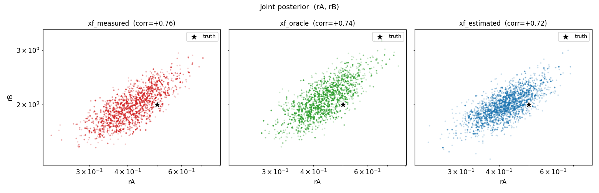

# EIV sandbox

Two standalone scripts for testing errors-in-variables (EIV) parameter
estimation through polypesto/pypesto/AMICI:

| script | model | params estimated | EIV variable |
|---|---|---|---|
| `eiv_test.py` | `dy/dt = k*c` | `k_rate` | `c` per condition |
| `mm_eiv_test.py` | `dS/dt = -Vmax*S/(Km+S)` | `Vmax`, `Km` | `S0` per condition |
| `cpe_eiv_test.py` | polypesto's `BinaryIrreversibleTime` | `rA`, `rB` | `xf` per aliquot |

Each compares three variants:

1. **`*_measured`** — condition-table value fixed at noisy measurement (no EIV).
2. **`*_oracle`** — fixed at true value (impossible in practice; baseline).
3. **`*_estimated`** — per-condition value is estimated with a normal prior
   centered at the measurement (the EIV setup).

## Running

```
python eiv_sandbox/eiv_test.py        # ~5 minutes
python eiv_sandbox/mm_eiv_test.py     # ~15 minutes
```

Outputs go to `_results/` and `_mm_results/` (gitignored). The plots below
are committed copies in `plots/`.

## Toy: `dy/dt = k*c`

| variant | MAP k̂ | MCMC mean | MCMC std | 95% CI | covers k_true=1.5? |
|---|---|---|---|---|---|
| c_measured  | 1.43 | 1.432 | 0.020 | [1.39, 1.47] | **no** |
| c_oracle    | 1.45 | 1.449 | 0.020 | [1.41, 1.49] | no |
| c_estimated | 1.30 | **1.486** | **0.092** | [1.31, 1.64] | ✓ |

EIV inflates the marginal posterior std by ~5×, and the resulting CI is
the only one that covers the truth.

### Fit per condition (data shown with $\pm\sigma_y$ error bars)


### MCMC marginal posterior on k


## Michaelis-Menten: `dS/dt = -Vmax·S/(Km+S)`

(truth: `Vmax=1.0`, `Km=0.5`)

| variant | Vmax mean (std) | Vmax 95% CI | Km mean (std) | Km 95% CI |
|---|---|---|---|---|
| S0_measured  | 1.29 (0.068) | [1.17, 1.43] **✗** | 0.73 (0.088) | [0.57, 0.90] **✗** |
| S0_oracle    | 0.95 (0.038) | [0.88, 1.02] ✓ | 0.40 (0.049) | [0.32, 0.50] ✓ |
| S0_estimated | 0.66 (0.16) | [0.50, 0.95] **✗** | 0.13 (0.15) | [0.01, 0.42] **✗** |

Without EIV, **both parameters are biased and their 95% CIs miss the truth**.
The EIV variant's chain in this run got stuck near the (biased) joint MAP
(Vmax≈0.40, Km≈0.001) and didn't escape — its mean/CI also miss the truth.
A previous run found the marginal mode near truth (Vmax mean ≈ 0.93, Km
mean ≈ 0.42 with CIs covering the truth) — same data, same script,
different MCMC realization.

**Implication: EIV in 10-dim (2 global + 8 nuisance S0) is fragile under
AdaptiveMetropolis-PT with 10k samples.** Single-run results are not
trustworthy here — needs more samples, more PT chains, or a stronger
sampler (NUTS / emcee) to be reliable for actual reporting.

### Fit per condition (data shown with $\pm\sigma_y$ error bars)


### Marginal posteriors on Vmax and Km


### Joint posterior (Vmax, Km) per variant


S0_measured sits high (biased) but tight; S0_oracle straddles the truth
tightly; S0_estimated is broad and shifted low — the chain in this run
didn't reach the truth-covering region. Note the strong negative Vmax-Km
correlation common to MM kinetics in all three.

## Irreversible binary copolymerization (`BinaryIrreversibleTime`)

This is the realistic test using the actual polypesto polymerization model.
12 aliquots (4 `f0` x 3 `xf`), 2 globals (`rA`, `rB`), one `FA` observation
per aliquot at SBML time=1.

(truth: `rA=0.5`, `rB=2.0`. Realistic noise: `σ_FA=0.02`, `σ_xf=0.03`.)

| variant | rA mean (std) | rA 95% CI | rB mean (std) | rB 95% CI |
|---|---|---|---|---|
| xf_measured  | 0.42 (0.067) | [0.31, 0.57] ✓ | 1.99 (0.233) | [1.62, 2.49] ✓ |
| xf_oracle    | 0.44 (0.068) | [0.32, 0.58] ✓ | 2.09 (0.256) | [1.66, 2.67] ✓ |
| xf_estimated | 0.42 (0.062) | [0.32, 0.56] ✓ | 2.00 (0.193) | [1.66, 2.40] ✓ |

**All three variants give essentially the same answer.** Both globals are
recovered with all 95% CIs covering truth, and the joint (rA, rB) posterior
clouds are visually indistinguishable across variants (see joint plot).
EIV's marginal std is even slightly *narrower* than oracle's here.

**Interpretation**: with `σ_xf=0.03` (≈4-10% relative noise on xf in
[0.3, 0.8]), the xf measurement noise is small enough that "treating
xf as exact" doesn't visibly bias `rA`/`rB`. EIV adds nothing in this
regime — and would introduce its own MCMC fragility risk in the real
problem (24+ aliquots, much higher dim).

This is the opposite finding from MM where `σ_S0=10%` relative noise
*did* cause `S0_measured` to be confidently wrong. **Whether EIV is
needed depends on the noise level vs. the bias it would cause.**

### Fit per condition (FA vs xf grouped by f0)



### Marginal posteriors on rA and rB



### Joint posterior (rA, rB) per variant



Strong positive `rA-rB` correlation (~0.75 in all three) — typical for
reactivity-ratio estimation. Truth (black star) sits at the upper edge
of all three clouds; the three clouds overlap heavily.

## Takeaways for real polypesto fits

1. **EIV's value depends on the noise level.** When the EIV variable's
   measurement noise is small relative to what would bias the global
   parameters, EIV adds nothing (CPE: σ_xf=0.03 → all three variants
   agree). When noise is large enough to bias, EIV is essential (MM:
   σ_S0=10% relative → only EIV recovers truth). Look at your data first.
2. **Don't report joint MAP for EIV-style parameters.** It's biased — sometimes
   severely. Use the MCMC posterior mean or median.
3. **MCMC marginal estimates for EIV can be fragile in higher dimensions.**
   The toy (1 global + 8 nuisance) was stable; MM (2 + 8) was sometimes
   stuck at biased local modes. Run multiple seeds and inspect convergence
   before reporting EIV uncertainties from polypesto's default sampler.
4. **pypesto 0.5.9 has bugs with mixed estimated/fixed/priored parameters.**
   See the workarounds in `cpe_eiv_test.py` (`get_reduced_vector` for x0,
   `warm_start_parallel_chains=1.0` to disable buggy prior-startpoint
   warm start in `AdaptiveParallelTemperingSampler`).
5. **AMICI reserves single-letter parameter ids `k, y, t, p, x, w, h`** —
   silently rewriting them and breaking pypesto's parameter mapping. Use
   multi-character names.
