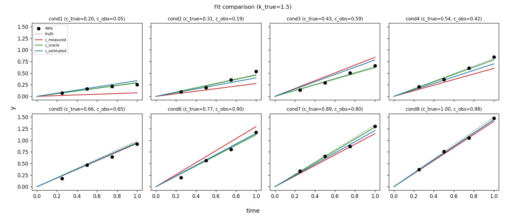
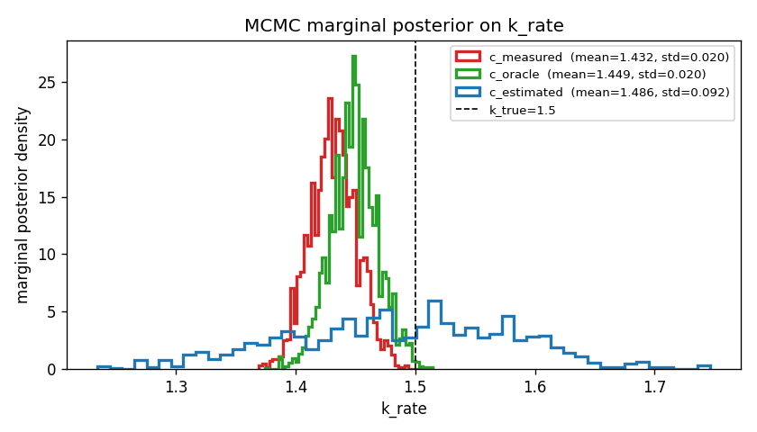
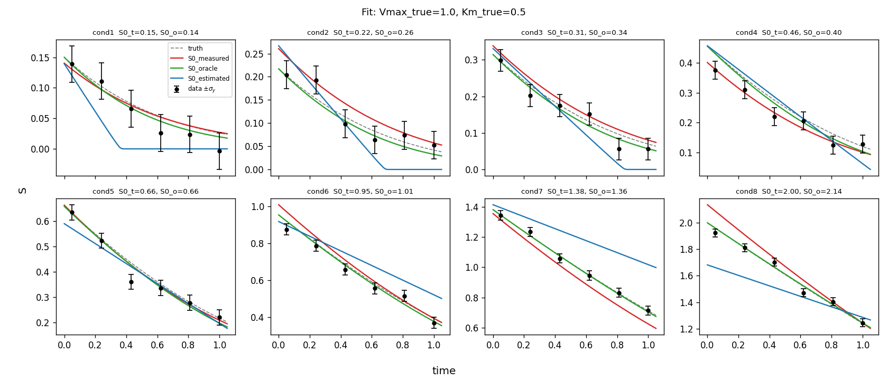
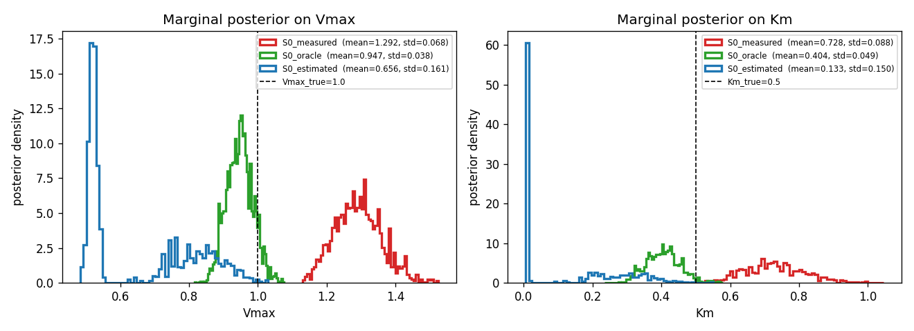
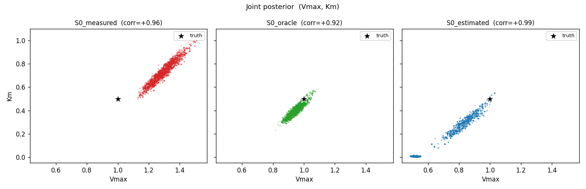

# EIV sandbox

Two standalone scripts for testing errors-in-variables (EIV) parameter
estimation through polypesto/pypesto/AMICI:

| script | model | params estimated | EIV variable |
|---|---|---|---|
| `eiv_test.py` | `dy/dt = k*c` | `k_rate` | `c` per condition |
| `mm_eiv_test.py` | `dS/dt = -Vmax*S/(Km+S)` | `Vmax`, `Km` | `S0` per condition |

Each compares three variants:

1. **`*_measured`** — condition-table value fixed at noisy measurement (no EIV).
2. **`*_oracle`** — fixed at true value (impossible in practice; baseline).
3. **`*_estimated`** — per-condition value is estimated with a normal prior
   centered at the measurement (the EIV setup).

## Running

```
python eiv_sandbox/eiv_test.py        # ~5 minutes
python eiv_sandbox/mm_eiv_test.py     # ~15 minutes
```

Outputs go to `_results/` and `_mm_results/` (gitignored). The plots below
are committed copies in `plots/`.

## Toy: `dy/dt = k*c`

| variant | MAP k̂ | MCMC mean | MCMC std | 95% CI | covers k_true=1.5? |
|---|---|---|---|---|---|
| c_measured  | 1.43 | 1.432 | 0.020 | [1.39, 1.47] | **no** |
| c_oracle    | 1.45 | 1.449 | 0.020 | [1.41, 1.49] | no |
| c_estimated | 1.30 | **1.486** | **0.092** | [1.31, 1.64] | ✓ |

EIV inflates the marginal posterior std by ~5×, and the resulting CI is
the only one that covers the truth.

### Fit per condition (data shown with $\pm\sigma_y$ error bars)



### MCMC marginal posterior on k



## Michaelis-Menten: `dS/dt = -Vmax·S/(Km+S)`

(truth: `Vmax=1.0`, `Km=0.5`)

| variant | Vmax mean (std) | Vmax 95% CI | Km mean (std) | Km 95% CI |
|---|---|---|---|---|
| S0_measured  | 1.29 (0.068) | [1.17, 1.43] **✗** | 0.73 (0.088) | [0.57, 0.90] **✗** |
| S0_oracle    | 0.95 (0.038) | [0.88, 1.02] ✓ | 0.40 (0.049) | [0.32, 0.50] ✓ |
| S0_estimated | 0.66 (0.16) | [0.50, 0.95] **✗** | 0.13 (0.15) | [0.01, 0.42] **✗** |

Without EIV, **both parameters are biased and their 95% CIs miss the truth**.
The EIV variant's chain in this run got stuck near the (biased) joint MAP
(Vmax≈0.40, Km≈0.001) and didn't escape — its mean/CI also miss the truth.
A previous run found the marginal mode near truth (Vmax mean ≈ 0.93, Km
mean ≈ 0.42 with CIs covering the truth) — same data, same script,
different MCMC realization.

**Implication: EIV in 10-dim (2 global + 8 nuisance S0) is fragile under
AdaptiveMetropolis-PT with 10k samples.** Single-run results are not
trustworthy here — needs more samples, more PT chains, or a stronger
sampler (NUTS / emcee) to be reliable for actual reporting.

### Fit per condition (data shown with $\pm\sigma_y$ error bars)



### Marginal posteriors on Vmax and Km



### Joint posterior (Vmax, Km) per variant



S0_measured sits high (biased) but tight; S0_oracle straddles the truth
tightly; S0_estimated is broad and shifted low — the chain in this run
didn't reach the truth-covering region. Note the strong negative Vmax-Km
correlation common to MM kinetics in all three.

## Takeaways for real polypesto fits

1. **Don't report joint MAP for EIV-style parameters.** It's biased — sometimes
   severely. Use the MCMC posterior mean or median.
2. **Without EIV, both bias and confidence-interval coverage suffer.** With
   noisy condition values, the standard "treat measurement as truth" approach
   gives wrong answers with overconfidence — the worst combination.
3. **MCMC marginal estimates for EIV are *fragile* in higher dimensions.**
   The toy (1 global + 8 nuisance) was stable across runs; the MM problem
   (2 global + 8 nuisance) gave qualitatively different EIV posteriors on
   different MCMC realizations. Run multiple seeds and inspect convergence
   before reporting EIV uncertainties from polypesto's default sampler.
4. **AMICI reserves single-letter parameter ids `k, y, t, p, x, w, h`** —
   silently rewriting them and breaking pypesto's parameter mapping. Use
   multi-character names.
