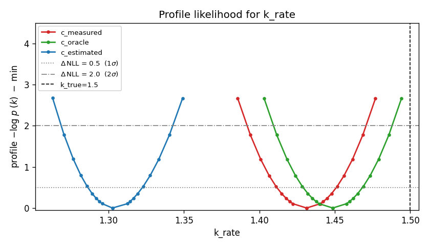

# EIV sandbox

Two standalone scripts for testing errors-in-variables (EIV) parameter
estimation through polypesto/pypesto/AMICI:

| script | model | params estimated | EIV variable |
|---|---|---|---|
| `eiv_test.py` | `dy/dt = k*c` | `k_rate` | `c` per condition |
| `mm_eiv_test.py` | `dS/dt = -Vmax*S/(Km+S)` | `Vmax`, `Km` | `S0` per condition |

Each compares three variants:

1. **`*_measured`** — condition-table value fixed at noisy measurement (no EIV).
2. **`*_oracle`** — fixed at true value (impossible in practice; baseline).
3. **`*_estimated`** — per-condition value is estimated with a normal prior
   centered at the measurement (the EIV setup).

## Running

```
python eiv_sandbox/eiv_test.py        # ~5 minutes
python eiv_sandbox/mm_eiv_test.py     # ~15 minutes
```

Outputs go to `_results/` and `_mm_results/` (gitignored). The plots below
are committed copies in `plots/`.

## Toy: `dy/dt = k*c`

| variant | MAP k̂ | MCMC mean | MCMC std | 95% CI | covers k_true=1.5? |
|---|---|---|---|---|---|
| c_measured  | 1.43 | 1.432 | 0.020 | [1.39, 1.47] | **no** |
| c_oracle    | 1.45 | 1.449 | 0.020 | [1.41, 1.49] | no |
| c_estimated | 1.30 | **1.486** | **0.092** | [1.31, 1.64] | ✓ |

EIV inflates the marginal posterior std by ~5×, and the resulting CI is
the only one that covers the truth.

### Fit per condition


### Profile likelihood (joint-MAP curvature)



The profile width understates EIV uncertainty — see the posterior plot below
for the proper marginal.

### MCMC marginal posterior on k


## Michaelis-Menten: `dS/dt = -Vmax·S/(Km+S)`

| variant | Vmax mean (std) | Vmax 95% CI | Km mean (std) | Km 95% CI |
|---|---|---|---|---|
| S0_measured  | 1.28 (0.065) | [1.17, 1.42] **✗** | 0.72 (0.085) | [0.57, 0.89] **✗** |
| S0_oracle    | 0.95 (0.040) | [0.87, 1.03] ✓ | 0.41 (0.051) | [0.31, 0.51] ✓ |
| S0_estimated | 0.93 (0.055) | [0.83, 1.04] ✓ | 0.42 (0.060) | [0.31, 0.55] ✓ |

(truth: `Vmax=1.0`, `Km=0.5`)

Without EIV, **both parameters are biased and their 95% CIs miss the truth.**
EIV recovers parameter means close to oracle and CIs cover truth. Joint MAP
for the EIV variant is severely biased here too (Vmax MAP=0.49, Km MAP=0.06)
— use MCMC posterior mean/median, not the optimizer's MAP.

### Fit per condition


### Marginal posteriors on Vmax and Km


### Joint posterior (Vmax, Km) per variant


The S0_measured cloud sits well away from the truth (black star); S0_oracle
and S0_estimated clouds straddle the truth. Note the negative Vmax-Km
correlation common to MM kinetics.

## Takeaways for real polypesto fits

1. **Don't report joint MAP for EIV-style parameters.** It's biased — sometimes
   severely. Use the MCMC posterior mean or median.
2. **Profile likelihood width is not the EIV marginal uncertainty.** Profile
   reports joint-mode curvature, which can be narrower than the proper marginal.
3. **Without EIV, both bias and confidence-interval coverage suffer.** With
   noisy condition values, the standard "treat measurement as truth" approach
   gives wrong answers with overconfidence — the worst combination.
4. **AMICI reserves single-letter parameter ids `k, y, t, p, x, w, h`** —
   silently rewriting them and breaking pypesto's parameter mapping. Use
   multi-character names.
